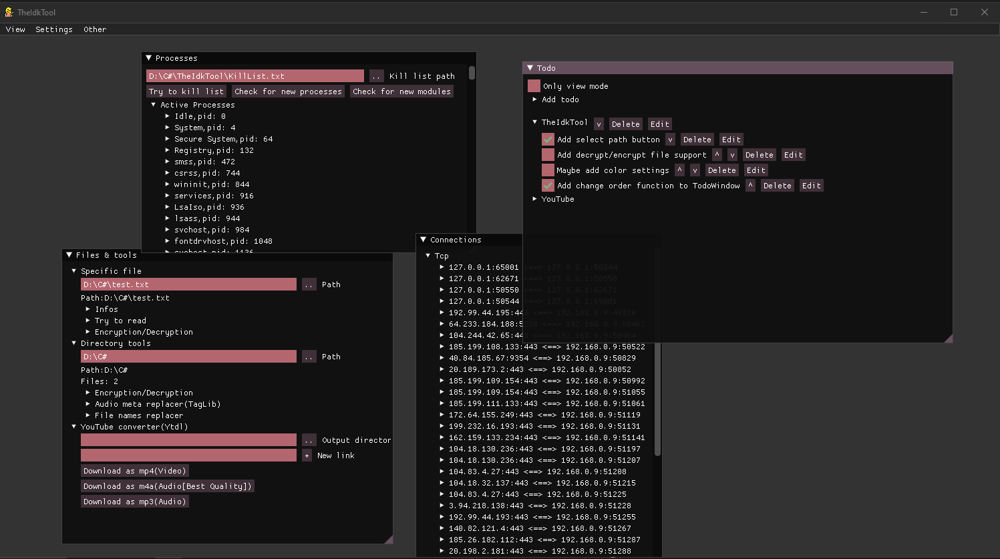

# TheIdkTool

## Random tools
In this program I add things that I need randomly, no target, no limit, currently you can download YouTube videos (m4a, mp3, mp4), change meta tags of music files, name replacer tools, todo list, view processes, kill processes from a list, view every tcp connection and a few more things.

## It doesn't start / an error occurs
Make sure you have "[dotnet 8.0 runtime](https://dotnet.microsoft.com/en-us/download/dotnet/8.0)" installed for your platform, if it still doesn't start please report the error.
